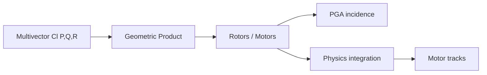

# Arquitectura — garust

## Propósito

From-scratch zero-dependency Clifford algebra library with PGA/CGA geometry, rigid-body physics, and motor-native animation.

## Mapa de módulos

```
garust/
├── crates/garust-core/     # Multivectors, products, signatures
├── crates/garust-geo/      # PGA/CGA, motors, conformal maps
├── crates/garust-physics/  # Rigid-body world, contacts
├── crates/garust-anim/     # Motor tracks, scene recording
├── crates/garust-derive/   # #[derive(Algebra)] proc-macro
├── examples/               # wizzielyn, motor_sensor_bridge
└── rfcs/                   # Design RFCs
```

## Diagrama de componentes



## Capas y responsabilidades

Ver [code-walkthrough.md](./code-walkthrough.md) para el recorrido módulo a módulo.

## Documentación adicional

- `README.md`
- `rfcs/`
- `crates/*/README.md`
