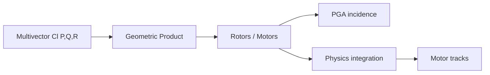
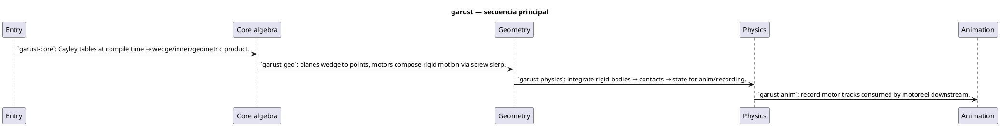
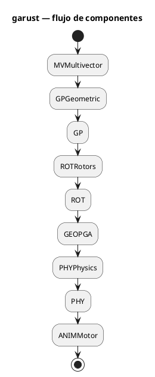

# Flujos — garust

## Flujo principal (Mermaid)

## Descripción paso a paso

1. **Entry** — `src/lib.rs` re-exports workspace crates; pick alias (`Pga3`, `Vga3`, `Cga3`).
2. **Core algebra** — `garust-core`: Cayley tables at compile time → wedge/inner/geometric product.
3. **Geometry** — `garust-geo`: planes wedge to points, motors compose rigid motion via screw slerp.
4. **Physics** — `garust-physics`: integrate rigid bodies → contacts → state for anim/recording.
5. **Animation** — `garust-anim`: record motor tracks consumed by motoreel downstream.

## Secuencia (PlantUML)

Fuente: [`diagrams/flow-sequence.puml`](./diagrams/flow-sequence.puml)

## Componentes / estados (PlantUML)

Fuente: [`diagrams/flow-architecture.puml`](./diagrams/flow-architecture.puml)

## Estados y casos borde

Consulta los tests de integración y los RFC/requirements del proyecto para flujos de error y recuperación.
